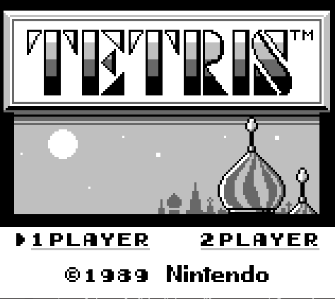

# Gameboy emulator
Gameboy emulator for DMG spec. It "works"™ but it probably won't run all games. I tested it out on pokemon red and tetris and it was just fine.

## Running
When running provide a path to rom file 
    `cargo run ./path/to/rom.gb`
## Controls 
`ESC - Exit`
```
     
     UP         |
LEFT     RIGHT  |  - Arrow keys
    DOWN        |
     
START - Q
SELECT - W
B - A
A - S

```


Resources that helped me greatly with this project. Big thanks to the gbdev community for their amazing work
- https://gbdev.io/pandocs/
- https://rgbds.gbdev.io/
- https://binji.github.io/posts/pokegb/

